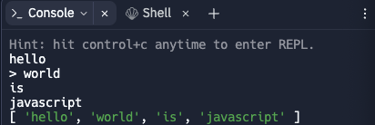

## 1. JS 핵심 문법

- fs 모듈 : 입력 데이터가 텍스트 파일 형태로 주어지는 경우 파일 시스템 모듈을 사용한다.

```js
let fs = require("fs");
let input = fs.readFileSync("/dev/stdin").toString().split(); // 문자열로 저장
```

- readline 모듈 : 한 줄씩 입력을 받아서 처리하여 정답을 출력할 경우

```js
const rl = require("readline").createInterface({
  input: process.stdin,
  output: process.stdout,
});

let input = [];
rl.on("line", function (line) {
  // 콘솔 입력 창에서 줄바꿈(Enter)를 입력할 때마다 호출
  input.push(line);
}).on("close", function () {
  // 콘솔 입력 창에서 ctrl + c 혹은 ctrl + D를 입력하면 입력의 종료
  console.log(input);
  process.exit();
});
```



- Array.prototype.reduce() : 배여르이 모든 원소에 대해 특정한 연산을 순차적으로 적용할 경우에 사용

```js
let data = [5, 2, 7, 22, 5];

// 최소값 구하기
let minValue = data.reduce((x, y) => Math.min(x, y));
console.log(minValue); // 2

// 합계 구하기
let summary = data.reduce((x, y) => x + y);
console.log(summary); // 41
```

- 배열 초기화 방법

```js
// 직접 값을 설정하여 초기화
let arr = [1, 2, 3, 4, 5];

// 길이가 5이고 모든 원소의 값이 0인 배열 초기화
let arr = new Array(5).fill(0);
```

- 집합 자료형 : 특정한 원소의 등장 여부를 파악하는 경우

```js
let mySet = new Set(); // 집합 객체 생성

// 여러 개의 원소 삽입
mySet.add(5);
mySet.add(6);
mySet.add(6);
mySet.add(2);

// 중복된 원소는 제거함.
console.log(`원소의 개수 : ${mySet.size}`); // 3
console.log(`원소 7를 포함하고 있는가? : ${mySet.has(7)}`); // false

// 원소 5 제거
mySet.delete(5);

// 원소를 출력
for (let item of mySet) console.log(item); // 6 2
```
