## 자료 구조

다수의 자료를 담기 위한 구조로 자료구조/알고리즘의 성능 측정 방법에 대한 이해가 필요하다.

### 자료구조의 종류

1. 선형 자료구조

하나의 데이터 뒤에 다른 데이터가 하나 존재하는 자료구조로 데이터가 일렬로 연속적으로 연결되어 있다.

- 배열
- 연결 리스트
- 스택
- 큐

2. 비선형 구조

하나의 데이터 뒤에 다른 데이터가 여러 개 올 수 있는 자료구조로 데이터가 일직선상으로 연결되지 않아도 된다.

- 트리
- 그래프

### 성능 측정 방법

- 시간 복잡도 : 연산 횟수를 측정
- 공간 복잡도 : 메모리의 양을 측정한다.

시간을 단축하는 방법이 흔히 사용된다. 일반적으로 빅오 표기법을 사용한다. 빅오 표기법이란 가장 빠르게 증가하는 항만을 고려하는 표기법이다.

## 배열

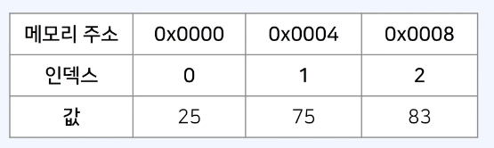
가장 기본적인 자료구조로 여러 개의 변수를 담는 공간이다. 인덱스가 존재하며 0부터 시작한다.

컴퓨터의 메인 메모리에서 배열의 공간은 연속적으로 할당된다. 따라서 캐시 히트 가능성이 높으며 조회가 빠르다. 다만 배열의 크기를 미리 지정해햐 하는 것이 일반적이므로 데이터의 추가 및 삭제에 한계가 있다.

- 특정한 인덱스에 직접적으로 접근 가능 : O(1)
- 특정 위치에 데이터를 삭제할 때 : O(N)
- 여러 배의 배열을 이어 붙일 경우 `concat()` : O(N)
- 특정 구간의 원소를 꺼낸 배열을 반환하는 경우 `slice(left, right)` : O(N)
- 특정한 값을 가지는 원소의 첫째 인덱스를 반환하는 경우 `indexOf()` : O(N)

=> 자바스크립트 배열 자료형은 동적 배열로, 배열의 용량이 가득 차면 자동으로 크기를 증가시킨다. 내부적으로 포인터를 사용하여 연결 리스트의 장점도 가지고 있다. 따라서 배열 혹은 스택의 기능이 필요할 때 사용할 수 있으나 큐의 기능을 제공하지는 못한다. (비효율적이다.)

**1차원 배열 생성하기**

```js
// 1. 대괄호 사용하기
let arr1 = [];
arr.push(7);
arr.push(8);
arr.push(9);

// 2. Array() 사용하기
let arr2 = new Array();
arr.push(7);
arr.push(8);
arr.push(9);

// 3. 원하는 값을 직접 입력하여 초기화
let arr3 = [1, 2, 3, 4, 5];

// 4. Array.from() 사용하기
let arr4 = Array.from({ length: 5 }, () => 7);
```

**2차원 배열 생성하기**

```js
// 1. 원하는 값을 직접 입력하여 초기화
let arr1 = [
  [1, 1],
  [2, 1],
  [3, 1],
];

// 2. Array.from() 사용하기
// 최신 JS 환경(ES6 이상)에서 사용할 수 있는 문법이다.
let arr2 = Array.from(Array(4), () => new Array(5)); // 2차원 배열을 생성한 이후에 초기화 할 수 있다. [[<5개 아이템>],[],[],[]]

// 3. 반복문을 이용하여 배열 초기화
let arr3 = new Array(3);
for (let i = 0; i < arr2.length; i++) {
  arr3[i] = Array.from({ length: 4 }, (undefined, j) => i * 4 + j);
}
```

## 연결 리스트 (Linked List)

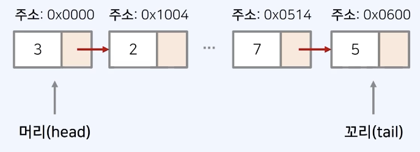

컴퓨터의 메인 메모리상에서 주소가 연속적이지 않다. 배열과 다르게 크기가 정해져 있지 않고 동적으로 변경이 가능하다. 포인터를 통해 다음 데이터의 위치를 가리킨다는 점에서 삽입과 삭제가 간편하지만 특정 번째의 원소를 검색할 때는 앞에서부터 원소를 찾아야 하므로 데이터 검색 속도가 느리다.

각 노드가 한 줄로 연결되어 있는 자료구조로 각 노드는 (데이터, 포인터) 형태를 가진다. 포인터는 다음 노드의 메모리 주로를 가리키는 목적으로 사용한다. 또한 각 노드의 포인터는 다음 혹은 이전 노드를 가리킨다.

이를 통해 스택과 큐등을 구현할 수 있지만 JS는 연결 리스트를 활용하는 자료구조를 제공하므로 실제 구현해야 하는 경우는 적다.

- 특정 위치에 데이터를 삭제 또는 삽입 때 : 포인터가 새로운 인덱스를 가리키도록 하면 되므로 O(1)
- 원소를 검색할 때 : O(N)

## 스택

먼저 들어온 데이터가 나중에 나가는 자료구조

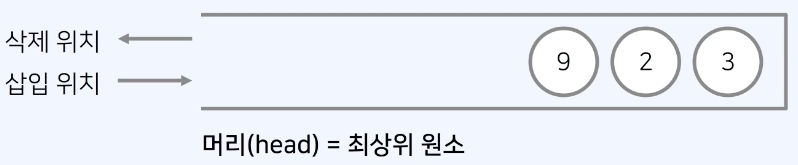

- 원소를 삽입하는 연산 : O(1)
- 원소를 추출하는 연신 : O(1)
- 스택의 최상위 원소를 확인하는 연산 : O(1)
- 스택이 비어있는지 확인하는 연산 : O(1)

**JS에서 스택을 구현하는 방법**

```js
// 배열로 구현하는 경우
// push()와 pop() 메서드를 사용한다. 두 메서드 모두 시간 복잡도는 O(1)이다.
let stack = [];

stack.push(5);
stack.push(2);
stack.push(3);
stack.pop();

let reversed = stack.slice().reverse();
console.log(reversed); // 최상위 원소부터 출력
```

## 큐

먼저 삽입된 데이터가 먼저 추출되는 자료구조

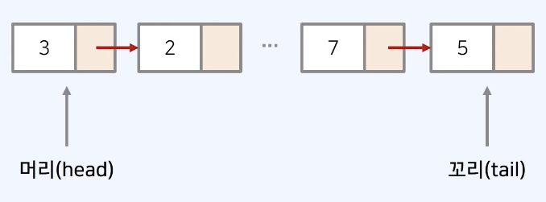

**JS에서 큐를 구현하는 방법**

=> 큐를 연결 리스트로 구현하면 삽입과 삭제에 있어서 O(1)을 보장할 수 있다. 연결 리스트로 구현할 땐 머리(가장 먼저 들어온 데이터)와 꼬리(가장 마지막에 들어온 데이터) 두 개의 포인터를 가진다. 삽입할 때는 꼬리 위치에 데이터를 넣고 삭제할 때는 머리 위치에서 데이터를 꺼낸다.

=> JS에서는 배열 자료형을 이용하는 것보다 Dictionary 자료형을 이용하여 큐를 구현하면 간단하다.

```js
class Queue {
  constructor() {
    this.items = {};
    this.headIndex = 0;
    this.tailIndex = 0;
  }
  enqueue(item) {
    this.items[this.tailIndex] = item;
    this.tailIndex++;
  }
  dequeue() {
    const item = this.items[this.headIndex];
    delete this.items[this.headIndex];
    this.headIndex++;
    return item;
  }
  peek() {
    return this.items[this.headIndex];
  }
  getLength() {
    return this.tailIndex - this.headIndex;
  }
}

// 구현된 큐(Queue) 라이브러리 사용
queue = new Queue();
// 삽입(5) - 삽입(2) - 삽입(3) - 삽입(7)
// - 삭제() - 삽입(1) - 삽입(4) - 삭제()
queue.enqueue(5);
queue.enqueue(2);
queue.enqueue(3);
queue.enqueue(7);
queue.dequeue();
queue.enqueue(1);
queue.enqueue(4);
queue.dequeue();
// 먼저 들어온 순서대로 출력
while (queue.getLength() != 0) {
  console.log(queue.dequeue());
}
```

## 트리 (Tree)

트리는 가계도와 같이 계층적인 구조를 표현할 때 사용할 수 있는 자료구조이다.

- 루트 노드는 부모가 없는 최상위 노드를 의미하며 단말 노드 (leaf node)는 자식이 없는 노드를 의미한다.
  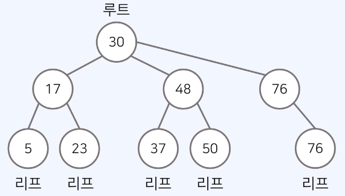
- 트리에서는 부모와 자식 관계, 형제 관계가 성립된다.
  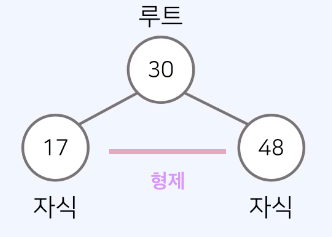
- 깊이(depth)는 루트 노드에서의 길이로 출발 노드에서 목적지 노드까지 거쳐야 하는 간선의 수를 의미하고 트리의 높이는 루트 노드에서 가장 깊은 노드까지의 길이를 의미한다.
  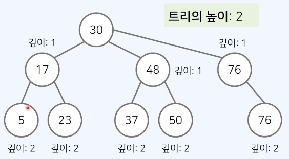

### 이진 트리

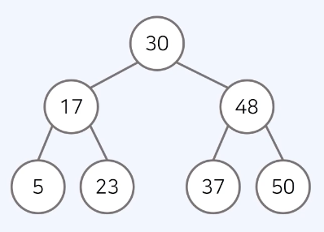

이진 트리는 최대 2개의 자식을 가질 수 있는 트리를 의미한다.

- 포화 이진 트리 : 리프 노드를 제외한 모든 노드가 두 자식을 가지고 있는 트리이다.
- 완전 이진 트리 : 모든 노드가 왼쪽 자식부터 차근차근 채워진 트리이다.
- 높이 균형 트리 : 왼쪽 자식 트리와 오른쪽 자식 트리의 높이가 1이상 차이 나지 않는 트리이다.

### 힙

완전 이진 트리 자료구조를 따르며 우선순위가 높은 노드가 루트에 위치한다.

- 원소의 삽입 연산 : 상향식으로 부모로 거슬러 올라간다 O(logN)
  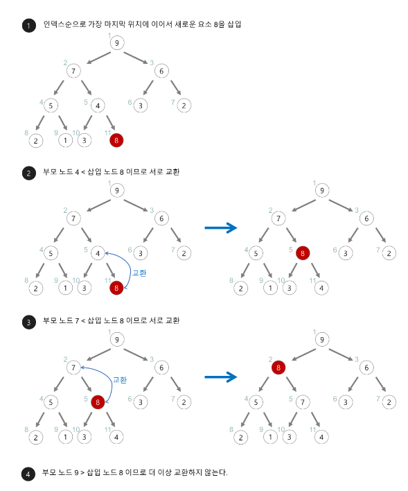
- 원소의 삭제 연산 : 루트 노드에서부터 하향식으로 heapify()을 진행한다. O(logN)
  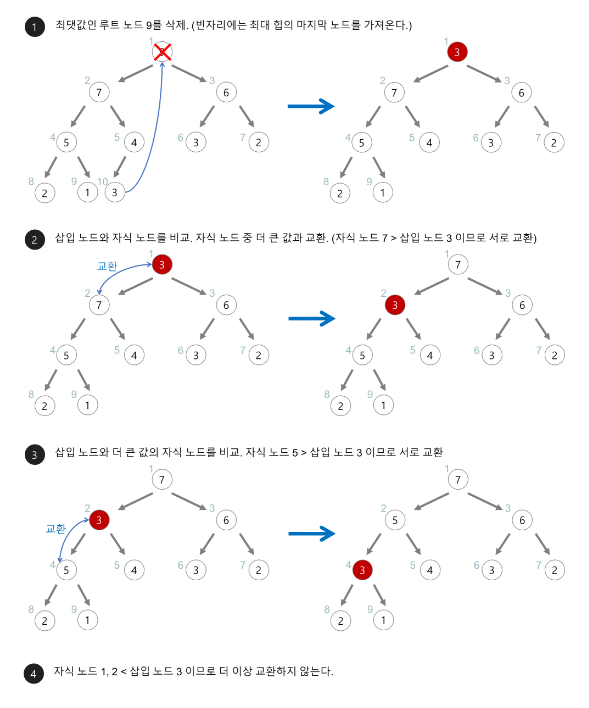
- N개의 데이터를 힙에 넣었다가 모두 꺼내는 작업 O(NlogN)

**JS에서 힙을 구현하기**

기본적으로 우선순위 규를 라이브러리로 제공하지 않으므로 별도의 라이브러리를 사용해야 한다.

해당 [라이브러리](https://github.com/ndb796/priorityqueuejs)를 가져온 후

```js
// 최대힙
let pq = new PriorityQueue function (a, b){
  return a.cash b.cash
});

pq.enq({cash: 250 , name: 'Doohyun Kim'})
pq.enq({cash: 300 , name: 'Gildong Hong'})
pq.enq({cash: 150 , name: 'Minchul Han'})
console.log(pq.size ()); // 3
console.log(pq.deq ()); // {cash: 300, name: Gildong Hong'}
console.log(pq.peek ()); // {cash: 250, name: Doohyun Kim'}
console.log(pq.size ()); // 2
```

#### 최대 힙

값이 큰 원소부터 추출하며, 부모 노드가 자신 노드보다 값이 큰 완전 이진 트리를 의미한다. 따라서 루트 노드는 전체 트리에서 가장 큰 값을 가진다.

#### 최소 힙

값이 작은 원소부터 추출하며 부모 노드의 키 값이 자식 노드의 키 값보다 항상 작다. 류트 노드가 가장 작으며 값이 작은 데이터가 우선순위를 가진다.

### 우선순위 큐

우선 순위에 따라서 데이터를 추출하는 자료구조이다.

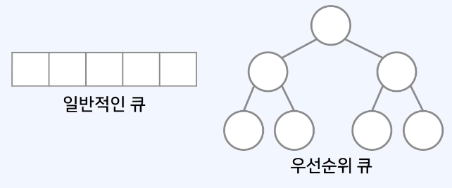

**우선순의 큐를 구현하는 방법**

1. 리스트 자료형의 경우 삽입시간은 O(1)이며 삭제시간은 O(N)이다.
2. 힙의 경우 삽입시간과 삭제시간이 O(logN)이다. 일반적으로 힙을 이용하여 구현한다. 보통 이진트리 구조를 사용한다.

## 그래프

그래프란 사물을 정점과 간선으로 나타내기 위한 도구이다. 그래프는 두 가지 방식으로 구현할 수 있다.

1. 인접 행렬 : 2차원 배열을 사용하는 방식
2. 인접 리스트 : 연결 리스트를 이용하는 방식

=> 최단 경로 알고리즘을 구현할 때는 간선 개수가 적어 인접 리스트가 유용하다. 이 두가지의 경우 문제에 따라 적절한 방법을 선택하는 것이 바람직하다.

### 인접 행렬

그래프를 2차원 배열로 표현한다.

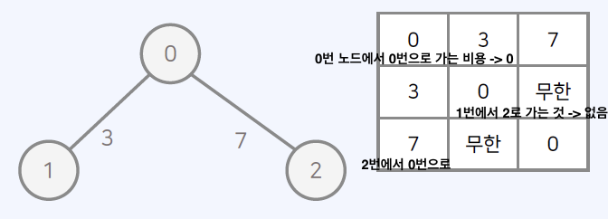

#### 무방향 무가중치 그래프

모든 간선이 방향성을 가지지 않는 그래프를 무방향 그래프라고 하며 모든 간선에 가중치가 없는 그래프를 무가중치 그래프라고 한다. 따라서 무방향 비가중치 그래프가 주어졌을 때 연결되어 있는 상황을 인접 행렬로 출력할 수 있다.

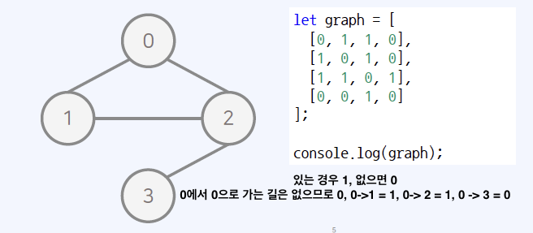

#### 방향 가중치 그래프

모든 간선이 방향을 가지고 가중치가 있는 그래프를 의미하며 방향 가중치 그래프가 주어졌을 때 연결되어 있는 상황을 인접 행렬로 출력할 수 있다.

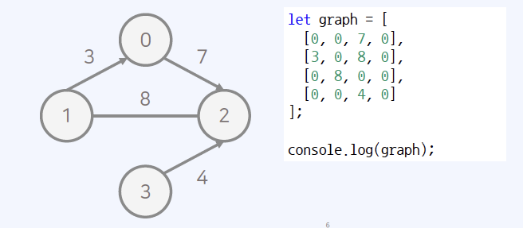

### 인접 리스트

그래프를 리스트로 표현한다.

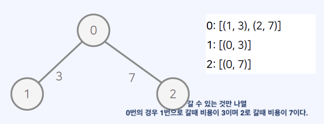

#### 무방향 무가중치 그래프

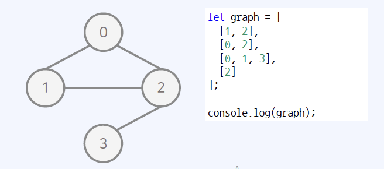

#### 방향 가중치 그래프

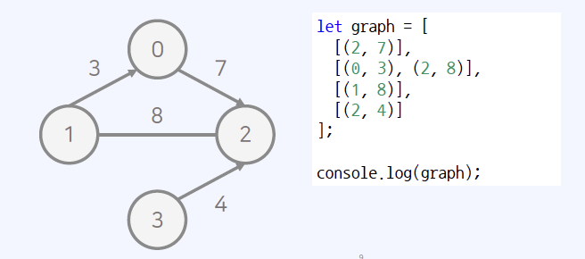

### 그래프의 시간 복잡도

- 인접 행렬의 경우 모든 정점들의 연결여부를 저장하여 O(V^2)의 공간을 요구한다. 공간 효율성은 떨어지지만 두 노드의 연결 여부를 O(1)에 확인할 수 있다.
- 인접 리스트의 경우 연결된 간선의 정보만을 저장하여 O(V + E)의 공간을 요구한다. 공간 효율성이 우수하지만 두 노드의 연결 여부를 확인하기 위해서 O(V)의 시간이 필요하다.
