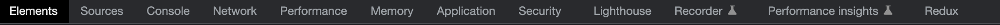

# 개발자 도구

개발자 도구는 다음과 같은 목록으로 구성되어 있다.

 

## Elements

HTML 구조가 보이고 각 태그별 내용을 확인할 수 있는 탭으로 HTML, CSS를 어떻게 해석하고 화면에 표시했는지 실제 렌더링 결과를 보여준다.

- **Styles** - 적용된 CSS를 확인 가능하고 변경 가능
- **Computed** - 엘리먼트에 크기, 패딩, 보더, 마진 사이즈를 이미지로 보여줌
- **Layout** - Grid/Flex 정보를 보여줌
- **Event Listeners** - 어떤 이벤트 리스너가 적용된 건지 알려줌
- **DOM BreakPoints** - HTML 디버깅할 때 사용함
- **Properties** - 선택된 노드에 모든 정보를 볼 수 있음
- **Accessibility** - 웹 접근성에 대한 정보를 보여줌

 

## Console

프론트엔드의 자바스크립트 코드에서 발생한 각종 메세지를 출력하고, 이용자가 입력한 자바스크립트 코드를 실행도 해주는 도구로 함수를 추가하거나 변수에 저장된 값을 확인하는 등의 작업도 할 수 있다.

 

## Sources

현재 페이지를 구성하는 웹 리소스와 디버깅 정보를 확인할 수 있다.

> ### 디버깅이란?
>> 스크립트 내 에러를 검출해 제거하는 일련의 과정을 의미한다. 개발자 도구 안에 UI 형태로 존재하는 디버깅 툴을 사용하면 디버깅이 훨씬 쉬워지고, 실행 단계마다 어떤 일이 일어나는지를 코드 단위로 추적할 수 있다.

>> [개발자 도구로 디버깅하기](https://ko.javascript.info/debugging-chrome)에서 더 자세한 사항을 확인할 수 있다.

- **파일 탐색 영역** – 페이지를 구성하는 데 쓰인 모든 리소스(HTML, JavaScript, CSS, 이미지 파일 등)를 트리 형태로 보여준다.
- **코드 에디터 영역** – 리소스 영역에서 선택한 파일의 소스 코드를 보여준다. 소스 코드를 편집할 수도 있다.
- **자바스크립트 디버깅 영역** – 디버깅에 관련된 기능을 제공한다. 
  - Watch: 원하는 자바스크립트 식을 입력하면, 코드 실행 과정에서 해당 식의 값 변화를 확인할 수 있다.
  - Call Stack: 함수들의 호출 순서를 스택 형태로 보여준다.
  - Scope: 정의된 모든 변수들의 값을 확인할 수 있다.
  - Breakpoints: 브레이크포인트들을 확인하고, 각각을 활성화 또는 비활성화할 수 있다.

 

## Network

서버와 오가는 데이터를 확인할 수 있다. 리소스가 예상대로 다운로드 또는 업로드되고 있는지 확인해야 하는 경우에 사용된다.

- **name** : 이름
- **status** : 상태 200이면 정상
- **type** : js, font, css 종류를 나타낸다
- **size** : 불러온 파일의 사이즈
- **time** : 해당 파일이 로드되는데 시간

 

## Performance
네트워크 패널은 자원들이 제대로 다운로드 되었는지의 여부, 캐시여부, 그리고 다운로드된 자원들의 다운로드에 걸린 시간, 세부 정보들을 보고 싶을 때 유용하게 사용할 수 있는 패널이다. 만일 초기 렌더링 속도, 애니메이션 속도, 응답 대기 시간 등을 개선하고 싶다면 Network보다는 Performance을 활용하는게 더 좋다.

> [크롬 개발자 도구의 Performance 탭 다루기](https://codingmoondoll.tistory.com/entry/%ED%81%AC%EB%A1%AC-%EA%B0%9C%EB%B0%9C%EC%9E%90-%EB%8F%84%EA%B5%AC%EC%9D%98-Performance-%ED%83%AD-%EB%8B%A4%EB%A3%A8%EA%B8%B0-%EA%B8%B0%EB%B3%B8%ED%8E%B8)에서 더 자세한 정보를 확인할 수 있다.
 

 

## Application

쿠키, 캐시, 이미지, 폰트, 스타일시트 등 웹 애플리케이션과 관련된 리소스를 조회할 수 있다.

