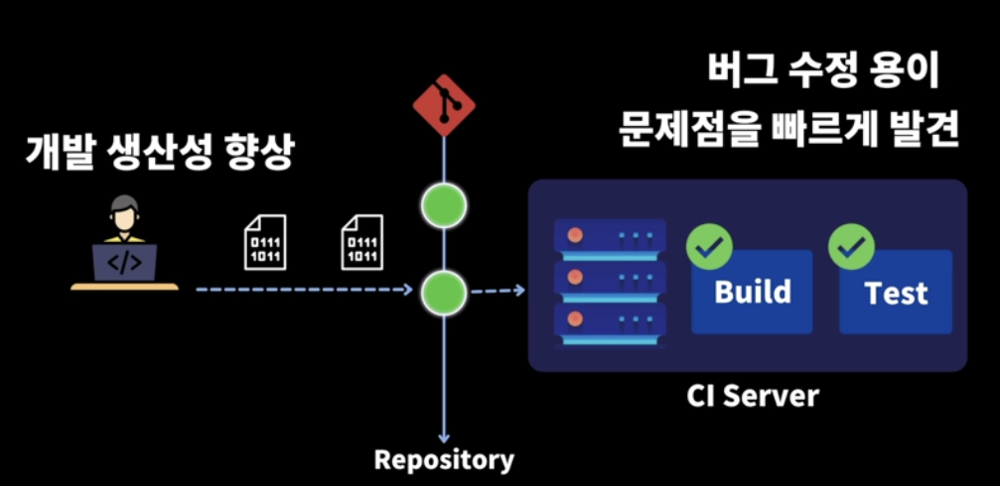
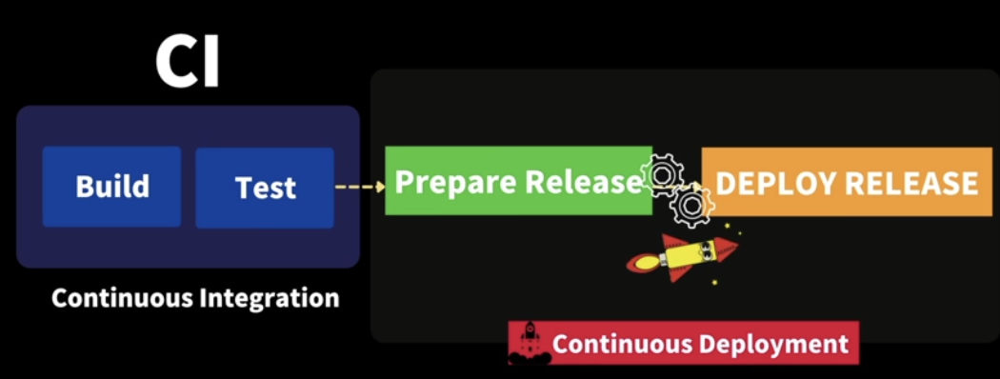

## CI/CD란?

### Continuous Integration (CI - 지속적 통합)

**코드 변경사항을 주기적으로, 빈번하게, 머지해야 한다.**

개발자들이 코드를 공유 저장소(Git 등)에 푸시할 때, 자동으로 빌드와 테스트를 수행하는 개발 방법론이다. 이를 통해 팀원들의 코드 변경 사항이 지속적으로 통합되며, 통합된 코드에 대한 오류를 빠르게 찾아낼 수 있다. CI를 구축하면, 개발자들은 주기적으로 빌드 및 테스트가 수행되는 개발 환경을 유지할 수 있고, 코드가 주기적으로 린트(Lint)나 단위 테스트 등을 통과하는지 확인할 수 있다.

### Continuous Deployment (CD - 지속적 배포)

**통합을 위한 단계 (빌드, 테스트, 머지)의 자동화**

CD는 CI를 통해 성공적으로 통합된 코드를 자동으로 운영 환경으로 배포하는 개발 방법론이다. CD를 구축하면, 팀은 소프트웨어를 자동으로 빠르게 배포하여 최신 기능을 빠르게 사용자에게 제공할 수 있다. 이를 통해 소프트웨어 개발과 배포 주기를 단축하고, 사용자에게 신속하게 가치를 제공할 수 있다.

### CI/CD를 위한 도구

