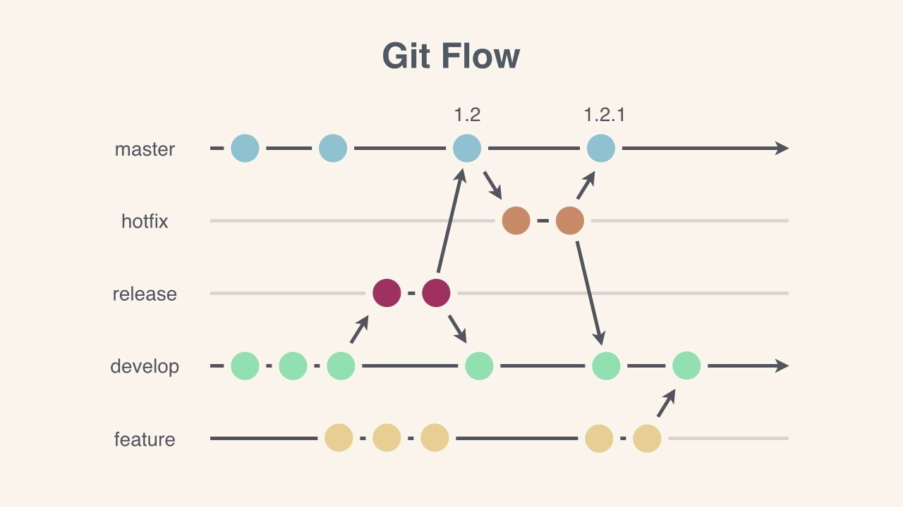
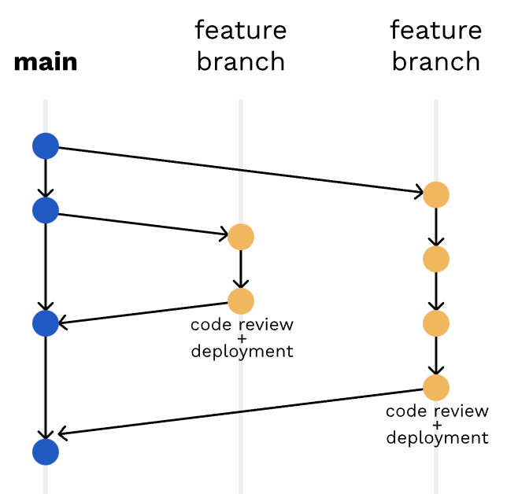

# branching models

git에서 제공하는 브랜치를 효율적으로 관리하기 위해 사용하는 브랜치 관리 전략(Branch management strategy)으로 Git flow, GitLab flow, Github flow 3개를 일반적으로 사용하고 있다.

 

## git flow
`(hotfix)- master -(release)- develop - feature` 구조이다. 이러한 git flow의 장점으로는 가장 많이 적용하고 각 단계가 명확히 구분하다는 점이며 단점은 복잡하다는 것이다.

- **master** : 라이브 서버에 제품으로 출시되는 브랜치
- **develop** : 다음 출시 버전을 대비하여 개발하는 브랜치
- **feature** : 추가 기능 개발 브랜치. develop 브랜치에 들어간다
- **release** : 다음 버전 출시를 준비하는 브랜치. develop 브랜치를 release 브랜치로 옮긴 후 QA, 테스트를 진행하고 master 브랜치로 합친다
- **hotfix** : master 브랜치에서 발생한 버그를 수정하는 브랜치

 

> ### git flow 설치하기
>
> [homebrew](https://brew.sh/index_ko)를 설치 후 [git flow](https://danielkummer.github.io/git-flow-cheatsheet/index.ko_KR.html)를 설치한다.
>
> > ##### homebrew 설치 방법 및 오류 시 해결법 - [1](https://www.lainyzine.com/ko/article/how-to-install-homebrew-for-m1-apple-silicon/#iterm2-terminal-%EC%95%B1%EC%9D%B4-%EC%95%A0%ED%94%8C-%EC%8B%A4%EB%A6%AC%EC%BD%98-%EC%95%84%ED%82%A4%ED%85%8D%EC%B2%98%EB%A1%9C-%EC%8B%A4%ED%96%89%EC%A4%91%EC%9D%B8%EC%A7%80-%ED%99%95%EC%9D%B8) [2](https://studyin-mysparetime.tistory.com/33) & [git flow 실습 레포](https://github.com/boyon99/git-flow)

 

## github flow

github flow는 git flow가 github에서는 사용하기가 복잡하다고 하여 나온 전략으로 위 3개의 전략 중 가장 간단한 전략이다. `master - feature` 구조이며 장점은 브랜치 모델을 단순화했다는 점이며 master의 모든 커밋은 deployable하다는 것이다. 단점은 CI 의존성 높고 실수에 민감하다는 점이다.

 

## gitlab flow

`production - pre-production - master - feature` 구조이며 장점은 deploy, issue에 대한 대응이 가능하도록 보완했다는 점이다. 단점은 git flow와 반대 구조이다.

 

## Reference

- [github flow vs git flow](https://inpa.tistory.com/entry/GIT-%E2%9A%A1%EF%B8%8F-github-flow-git-flow-%F0%9F%93%88-%EB%B8%8C%EB%9E%9C%EC%B9%98-%EC%A0%84%EB%9E%B5)
