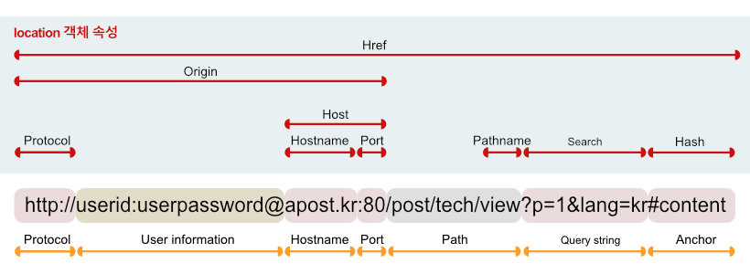

# 브라우저의 렌더링 과정

1. 브라우저는 HTML, CSS, JS, 이미지, 폰트 등 렌더링에 필요한 리소스를 요청하고 서버로부터 응답을 받는다.
2. 브라우저의 렌더링 엔진은 서버로부터 응답된 HTML과 CSS를 파싱하여 DOM과 CSSOM을 생성하고 이들을 결합하여 렌더 트리를 생성한다.
3. 브라우저의 자바스크립트 엔진은 서버로부터 응답된 자바스크립트를 파싱하여 AST를 생성하고 바이트코드로 변환하여 실행한다. 이때 자바스크립트는 DOM API를 통해 DOM이나 CSSOM를 변경할 수 있다.
4. 렌더 트리를 기반으로 HTML 요소의 레이아웃을 계산하고 브라우저 화면에 페인팅한다.

 

## 요청과 응답
서버에 요청을 전송하기 위해 브라우저는 주소창을 제공한다. 
 

 

## HTTP 1.1과 HTTP 2.0
HTTP(HyperText Transfer Protocol)는 웹에서 브라우저와 서버가 통신하기 위한 규약이다. 

### HTTP/1.1
기본적으로 커넥션(connection) 하나당 하나의 요청과 응답만 처리한다. 따라서 HTML 문서 내에 포함된 여러 개의 리소스 요청이 개별적으로 전송되고 응답 또한 개별적으로 전송된다. 따라서 요청할 리소스의 개수에 비례하여 응답시간도 증가하는 단점이 있다.

### HTTP/2
커넥션당 여러 개의 요청과 응답이 가능하다. 따라서 페이지 로드 속도가 1.1보다 50% 빠르다.

 

## HTML 파싱과 DOM 생성
브라우저 요청에 의해 서버가 응답한 HTML 문서는 문자열로 이루어진 순수한 텍스트이다. 따라서 브라우저가 이해할 수 있는 자료구조로 변환하여 메모리에 저장해야 한다. 이에 따라 DOM을 생성한다.

1. HTML 파일이 브라우저의 요청에 의해 응답된다. 이때 서버는 메모리에 파일을 저장한 다음 메모리에 저장된 바이트를 응답한다.
2. 브라우저는 HTML 문서를 바이트 형태로 응답받는다. 바이트 형태의 HTML 문서는 meta 태그의 charset 속성에 의해 지정된 인코딩 방식 기준으로 문자열로 변환된다.
3. 문자열로 변환된 HTML 문서를 읽어 문법적의미를 갖는 코드의 최소 단위인 토근들로 분해한다.
4. 각 토근들을 객체로 변환하여 노드들을 생성한다. 노드는 DOM을 구성하는 기본 요소가 된다.
5. HTML 요소는 중첩 관계를 가지게 되며 이에 따라 부자 관계가 형성된다. 이를 반영하여 모든 노드들을 트리 자료구조로 구성하며 이를 DO이라고 부른다.

즉, DOM은 HTML문서를 파싱한 결과물이다.

 

## CSS 파싱과 CSSOM 생성
DOM을 생성해 나가다 CSS를 로드하는 link 태그나 style 태그를 만나면 DOM 생성을 일시 중단한다. 그리고 CSS 파일을 서버에 요청하여 로드한 CSS을 HTML과 동일한 파싱 과정(문자열 -> 문자 -> 토큰 -> 노드 -> CSSOM)을 거치며 해석하여 CSSOM를 생성한다. 이후 CSS 파싱을 완료하면 HTML 파싱이 중단된 지점부터 다시 HTML을 파싱하기 시작한다.

 

## 렌더 트리 생성
DOM과 CSSOM은 렌더링을 위한 렌더 트리로 결합된다. 렌더 트리는 렌더링을 위한 트리 구조의 자료구조이다. 따라서 브라우저 화면에 렌더링되지 않는 노드(meta, script)와 CSS에 의해 비표시(display:none)되는 노드들은 포함하지 않는다. 이후 완성된 렌더 트리는 각 HTML 요소의 레이아웃을 계산하는데 사용되며 브라우저 화면에 픽셀을 렌더링하는 페인팅 처리에 입력된다.

### 렌더링 과정이 반복되서 실행되는 경우
- 자바스크립트에 의한 노드 추가 또는 삭제
- 브라우저 창에 리사이징에 의한 뷰포트 크기 변경
- HTML 요소의 레이아웃에 변경을 발생시키는 (width, margin, padding) 등의 스타일 변경

다음의 경우 레이아웃 계산과 페인팅이 재차 실행되며 이는 성능에 악영향을 주는 작업이다.

 

## 자바스크립트 파싱과 실행
DOM은 HTML 요소와 스타일 등을 변경할 수 있는 DOM API를 제공한다. 즉 자바스크립트 코드에서 동작으로 조작할 수 있다. CSS와 마찬가지로 DOM 생성 과정에서 script 태그를 만나면 생성을 일시 중단한다. 그 후 자바스크립트 엔진에 제어권을 넘긴다. 이후 자바스크립트 파싱과 실행이 종료되면 다시 렌더링 엔진으로 제어권을 넘겨 DOM 생성을 재개한다.

### 자바스크립트 파싱과 실행은 자바스크립트 엔진이 처리한다.
자바스크립트 엔진은 자바스크립트 코드를 파싱하여 CPU가 이해할 수 있는 저수준 언어로 변환하고 실행하는 역할을 한다. 자바스크립트 엔진은 구글 크롬과 Node.js 등 다양한 종류가 있으며 모든 자바스크립트 엔진은 ECMAScript 사양을 준수한다. 

### 자바스크립트 파싱과 실행 과정
자바스크립트 엔진은 자바스크립트를 해석하여 AST(추상적 구문 트리)를 생성한다. 그리고 이를 기반으로 인터프리터가 실행할 수 있는 중간 코드인 바이트 코드를 생성하여 실행한다.

#### 토크나이징
단순한 문자열인 자바스크립트 소스코드를 어휘 분석하여 문법적 의미를 갖는 코드의 최소단위인 토큰들로 분석한다.

#### 파싱
토근들의 집합을 구문분석하여 AST를 생성한다. 이는 문법적 의미와 구조를 반영한 트리 자료구조이다. AST를 사용하면 `TS` `Babel` 같은 트랜스파일러를 구현할 수도 있다. 
