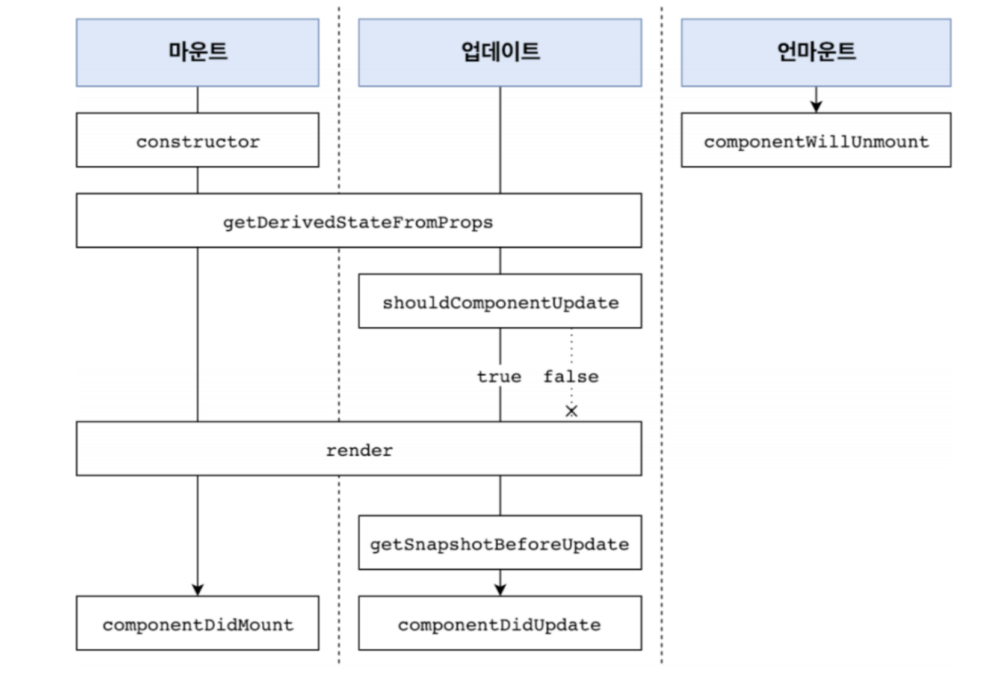

# 라이프사이클 메서드 (생명주기 메서드)

모든 리액트 컴포넌트에는 라이프사이클이 존재하며 컴포넌트의 수명은 페이지에 렌더링되기 전인 준비 과정에서 시작하여 페이지에서 사라질 때 끝난다. 이때 컴포넌트를 업데이트 전후로 컴포넌트의 라이프사이클 메서드를 통해 처리할 수 있다. 라이프사이클 메서드는 클래스형 컴포넌트에서만 사용할 수 있다. 함수 컴포넌트에서는 `React.memo`나 `useEffect` 등의 Hook을 통해 처리한다.

> [상세코드](https://codesandbox.io/s/react-life-cycle-ey2mwc?file=/src/App.js)에서 확인할 수 있다.

<br/>

## 라이프사이클 메서드의 이해

라이프사이클 메서드의 종류는 총 아홉가지이다. `Will` 접두사가 붙은 메서드는 어떤 작업을 작동하기 전에 실행되는 메서드이며 `Did` 접두사가 붙은 메서드는 어떤 작업을 작동한 후에 실행되는 메서드이다. 이 메서드들은 컴포넌트 클래스에서 덮어 써 선언함으로써 사용할 수 있다.

라이프사이클은 마운트, 업데이트, 언마운트로 나뉜다. 이 세가지에 포함되지 않는 `componentDidCatch` 메서드가 존재한다.



### 마운트

DOM이 생성되고 웹 브라이저 상에 나타나는 것으로 이때 호출하는 메서드는 다음과 같다.

- `constructor`
- `getDerivedStateFromProps`
- `render`
- `componentDidMount`

### 업데이트

컴포넌트는 다음과 같은 네 가지 경우에 리렌더링(업데이트) 한다.

1. props가 바뀔 때
2. state가 바뀔 때
3. 부모 컴포넌트가 리렌더링 될 때
4. this.forceUpdate로 강제로 렌더링을 트리거할 때

이때 호출하는 메서드는 다음과 같다.

- `getDerivedStateFromProps`
- `shouldComponentUpdate`
- `render`
- `getSnapshotBeforeUpdate`
- `componentDidUpdate`

### 언마운드

마운트의 반대 과정, 즉 컴포넌트를 DOM에서 제거하는 것을 의미한다. 호출하는 메서드는 다음과 같다.

- `componentWillUnmount`

<br/>

## 라이프사이클 메서드 살펴보기

### constructor 메서드

컴포넌트의 생성자 메서드로 컴포넌트를 만들 때 처음으로 실행된다. 이 메서드에서 초기 state를 정할 수 있다.

```js
constructor(props) {
  super(props); // #000000
  console.log("constructor");
  this.state = {
    number: 0,
    color: null,
  };
}
```

### getDerivedStateFromProps 메서드

props로 받아 온 값을 state에 동기화 시키거나 props의 변화에 따라 state 값에도 변화를 주고 싶을 때 사용한다. 컴포넌트가 마운트될 때와 업데이트될 때 호출한다.

```js
static getDerivedStateFromProps(nextPorps, prevState){
  if(nextPorps.value !== prevState.value){ // 조건에 따라 특정 값 동기화
    return { value : nextPorps.value}
  }
  return null; // state를 변경할 필요가 없다면 null 반환
}
```

### render() 함수

컴포넌트의 모양새를 정의한다. 라이프메서드 중 유일한 필수 메서드이다. 이 메서드 안에서 this.props와 this.state에 접근할 수 있으며 리액트 요소를 반환한다. 아무것도 보여주고 싶지 않다면 null이나 false를 반환한다.

```js
  render() {
    return (<></>);
  }
```

### componentDidMount 메서드

렌더링이 다 끝난 후 실행한다. 이 안에서 다른 자바스크립트 라이브러리나 프레임워크 함수를 호출하거나 이벤트 등록, setTimeOut, setInterval, 네트워크 요청 같은 비동기 작업을 처리하면 된다.

```js
  componentDidMount() {
    console.log('componentDidMount');
  }
```

### shouldComponentUpdate 메서드

props 또는 state를 변경했을 때 리렌더링을 시작할지 여부를 지정하는 메서드이다. true 또는 false 값을 반환한다. 기본값은 true이다. false값을 반환하면 업데이트 과정은 여기서 중지된다. 이 메서드 안에서 현재 props와 state는 this.props와 this.state로 접근하고 새로 설정될 props나 state는 nextProps와 nextState로 접근한다. 특정 함수에서 this.forceUpdate() 함수를 호출하면 이 과정을 생략하고 바로 render함수를 호출한다.

```js
shouldComponentUpdate(nextProps, nextState) {
  console.log("shouldComponentUpdate", nextProps, nextState);
  // 숫자의 마지막 자리가 4면 리렌더링하지 않는다.
  return nextState.number % 10 !== 4;
}
```

### getSnapshotBeforeUpdate 메서드

render에서 만들어진 결과물이 브라우저에 실제로 반영되기 직전에 호출된다. 이 메서드에서 반환하는 값은 componentDidUpdate에서 세 번째 파라미터인 snapshot 값으로 전달받을 수 있는데 주로 업데이트하기 직전의 값을 참고할 일이 있을 때 활용된다.

```js
getSnapshotBeforeUpdate(prevProps, prevState) {
  console.log("getSnapshotBeforeUpdate");
  if (prevProps.color !== this.props.color) {
    return this.myRef.style.color; // snapshot
  }
  return null;
}
```

### componentDidUpdate 메서드

리렌더링을 완료한 후 실행한다. 업데이트가 끝난 직후이므로 DOM 관련 처리를 해도 된다. 여기서는 prevProps나 prevState를 사용하여 컴포넌트가 이전에 가졌던 데이터에 접근할 수 있다. 또한 getSnapshotBeforeUpdate에서 반환한 값이 있으면 여기서 전달받을 수 있다.

```js
componentDidUpdate(prevProps, prevState, snapshot) {
  console.log("componentDidUpdate", prevProps, prevState);
  if (snapshot) {
    console.log("업데이트되기 직전 색상: ", snapshot);
  }
}
```

### componentWillUnmount 메서드

컴포넌트를 DOM에서 제거할 때 실행한다. componentDidMount에서 등록한 이벤트, 타이머, 직접 생성한 DOM이 있다면 여기서 제거 작업을 해야 한다.

```js
componentWillUnmount() {
  console.log('componentWillUnmount');
}
```

### componentDidCatch 메서드

컴포넌트 렌더링 도중 에러가 발생했을 때 애플리케이션이 먹통이 되지 않고 오류 UI를 보여줄 수 있게 한다.

```js
// info 파라미터는 어디에 있는 코드에서 오류가 발생했는지에 대한 정보를 준다
componentDidCatch(error,info){
  this.setState({
  // error는 파라미터에 어떤 에러가 발생헀는지 알려줌
    error : true
  })
  console.log({error, info})
}
// 컴포넌트 자신에게 발생하는 에러는 잡아낼 수 없고 this.props.children으로 전달되는 컴포넌트에서 발생하는 에러만 잡아낼 수 있음
```
