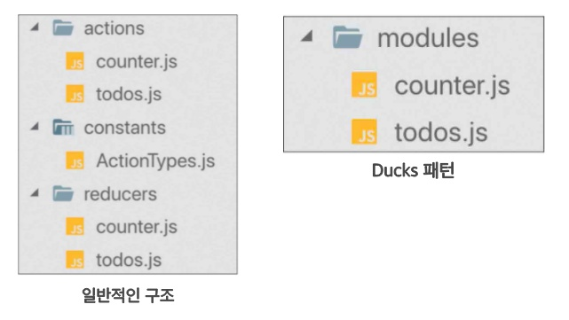

# 리덕스

리덕스는 가장 많이 사용하는 리액트 상태 관리 라이브러리이다.

#### 다음과 같은 특징을 가진다.

- **단일 스토어** : 하나의 앱 안에는 하나의 스토어가 들어간다.
- **읽기 전용 상태** : 리덕스 상태는 읽기 전용으로 상태 업데이트 시 불변성을 유지해야 한다.
- **리듀서는 순수한 함수** : 변화를 일으키는 리듀서는 순수한 함수여야 한다. 순수한 함수는 다음 조건을 만족한다.
  - 리듀서 함수는 이전 상태와 액션 객체를 파라미터로 받는다.
  - 파라미터 외의 값에는 의존하면 안된다.
  - 불변성을 유지하여 반환해야 한다.
  - 같은 파라미터로 호출된 리듀서 함수는 언제나 같은 값을 반환해야 한다.

#### 리덕스를 사용하는 이유는 다음과 같다.

- 컴포넌트의 상태 업데이트 관련 로직을 다른 파일로 분리시켜 더욱 효율적으로 관리할 수 있다.
- 컴포넌트끼리 동일한 상태를 공유해야 할 때 여러 컴포넌트를 거치지 않고 손쉽게 상태 값을 전달하거나 업데이트 할 수 있다.
- 전역 상태를 관리할 때 효과적이다.
- 편리한 개발자 도구를 지원한다.
- 미들웨어라는 기능을 통해 비동기 작업을 효율적으로 관리한다.

<br/>

> [valina-redux](https://codesandbox.io/s/vanilla-js-redux-5cc8ez) 알아보기

<br/>

## 리덕스 구조

### 액션

상태에 어떠한 변화가 필요하면 액션이 발생하며 하나의 객체로 표현된다.

```js
// 액션 객체는 type 필드를 반드시 가져야 한다. 이 값이 액션의 이름이다.
{
  type: "TOGGLE_VALUE";
  data: {
    id: 1;
  }
}
```

### 액션 생성 함수 (action creator)

액션 생성 함수는 액션 객체를 만들어 주는 함수로 항상 액션 객체를 리턴해야 한다.

```js
function addTodo(data) {
  // 액션 객체
  return {
    type: "ADD_TODO",
    data,
  };
}

// 화살표 함수로 구현할 수도 있다.
const changeInput = (text) => ({
  type: "CHANGE_INPUT",
  text,
});
```

### reducer

변화를 일으키는 함수로, 액션을 만들어서 발생시키면 리듀서가 현재 상태(store)와 전달받은 액션 객체(action)를 파라미터로 받아온다. 그리고 새로운 상태를 만들어서 반환한다.

```js
const initialState = {
  counter: 1,
};

function reducer(state = initialState, action) {
  switch (action.type) {
    case INCREMENT:
      return {
        counter: state.counter + 1,
      };
    default:
      return state;
  }
}
```

### store

리덕스를 적용하기 위해 스토어를 만든다. 한개의 프로젝트에 하나의 스토어만 생성할 수 있다. 스토어 안에는 현재 앱 상태와 리듀서 및 내장 함수가 있다.

```js
// index.js
// 스토어 생성
import { legacy_createStore as createStore } from "redux";
import counter from "./reducers/counter";

const store = createStore(counter);

export default store;
```

### Provider

store를 Provider를 통해 컴포넌트에 공유하여 어떤 컴포넌트에서든 리듀서와 상태를 가져와서 사용할 수 있다.

```js
import { Provider } from "react-redux";
import store from "./redux";

function App() {
  return (
    <Provider store={store}>
      <Counter />
    </Provider>
  );
}
```

### useSelector

redux로 관리 중인 상태를 가져오기 위한 Hook이다.

```js
import { useSelector } from "react-redux";

const { number } = useSelector((state) => state);
```

### dispatch

스토어의 내장 함수 중 하나로 '액션을 발생시키는 것'이다. 이 함수는 dispatch(action) 같은 형태로 액션 객체를 파라미터에 넣어서 호출한다. 함수 호출 시 스토어는 리듀서 함수를 실행시켜 새로운 상태를 만들어 준다.

```js
divToggle.onclick = () => {
  store.dispatch(toggleSwitch());
};
```

### useDispatch

dispatch 함수를 실행할 수 있도록 해주는 Hook이다.

```js
import { useDispatch } from "react-redux";

const dispatch = useDispatch();

// 사용 예시
dispatch(incCount(1));
```

### 구독 (subscribe)

스토어의 내장 함수 중 하나로 리스너 함수를 파라미터로 넣어서 호출하면 리스너 함수가 액션이 디스패치되서 상태가 업데이트 될 때마다 호출된다.

```js
const listener = () => {
  console.log("update");
};
const unsubscribe = store.subscribe(listen);
unsubscribe();
```

<br/>

## react redux

### MVC 패턴과 Flux 패턴

#### MVC 패턴

`MVC 패턴`은 Flux 패턴이 등장하기 전에 대부분의 앱이 사용하고 있던 소프트웨어 디자인 패턴이다.


- Model : 데이터를 보관하는 역할
- Controller : 데이터에 대한 수정, 조회 등의 역할
- View : 데이터를 화면에 보여주는 역할

Controller를 통해서 Model(데이터)을 수정하고 그 데이터를 View(화면)에 보여주거나 (Controller → Model → View) View에서 사용자와의 상호작용을 통해서 Model을 수정할 수 있도록 한다. (View → Model)

그러나 모델과 뷰가 많아지면 복잡해진다.

#### Flux 패턴

이러한 복잡성을 해결하고자 등장한 것이 바로 `Flux 패턴`으로 [https://facebook.github.io/flux/](https://facebook.github.io/flux/) 이 Flux 패턴은 MVC 패턴과는 다르게 단방향의 데이터 흐름을 가지고 있다.


- Action : 데이터에 대해서 정확히 어떤 상태 변화를 할지 지정
- Dispatcher : Store 에 Action 을 전달하는 역할 (동기적으로 실행되어 데이터 흐름을 관리)
- Store : Dispatcher 로부터 action 을 받아서 데이터의 상태를 변경하고 보관 (상태가 변경되면 변경되었다고 알림)
- View : 데이터를 화면에 보여주는 역할 (데이터를 자식 컴포넌트 등으로 보내주는 컨트롤러의 역할도 함께 함)

이렇게 할 경우 action 객체만 잘 따라가도, 정확히 어떤 데이터 변화가 일어나고 있는지 추적할 수 있다. View 에서 사용자와의 상호작용에 따라 새로운 Action 객체가 생성되더라도, 항상 dispatcher 를 통하기 때문에 데이터의 흐름이 한 방향으로 흐르게 된다.


`redux` 는 이 Flux 패턴을 기반으로 만들어져 있는데, 특징이자 차이점은 다음과 같다.

- store 는 데이터의 보관 역할만 담당함
- reducer 가 데이터의 갱신 역할을 담당함
- dispatcher 가 없음 (reducer 가 대신 action 에 따른 전달을 담당함)

> [Container Presenter/파일 구분 방식을 통해 카운터 구현하기](https://github.com/boyon99/redux/commit/85d30999f1e3a84c8b063edc1c236d8610db2908) > [payload를 통해 데이터 전달하기](https://github.com/boyon99/redux/commit/a38656db508a30eb000a79a240bbf64df4c8c2b1) > <br/>

### Container Presenter 패턴과 Ducks 패턴



#### Container Presenter 패턴

**Container Presenter 패턴**이란 리액트 디자인 패턴 중의 하나로, 기능과 UI를 컴포넌트 상으로 분리하는 것을 의미한다. 데이터를 처리하고, 받아오는 부분(기능)은 `Container 컴포넌트`에서 담당하고, 데이터를 보여주는 부분(UI)은 `Presenter 컴포넌트`에서 담당하도록 분리하는 것이다.

Presenter - Container 패턴은 예전에 많이 쓰이던 방식으로 최근에는 Hook 을 만들어서 로직을 분리하는 작업을 진행할 수 있기 때문에, 현재는 추천하지 않는다.

#### Ducks 패턴

ducks 패턴이란 위 패턴처럼 파일을 분리하지 않고, 하나의 파일에다가 모든 코드를 작성하는 것으로 코드 작성이 조금 더 용이해지고, 폴더 구조 상의 가독성이 더 좋아진다는 장점이 있다. 이렇게 작성한 코드를 모듈이라고 부른다.

> [Container Presenter/ducks 패턴을 통해 카운터 구현하기](https://github.com/boyon99/redux/commit/82337cad8719e6653c075a5b88dbee2834d14d44)

<br/>

### Combine Reducer

만약 리듀서가 여러 개라면, 여러 개의 리듀서를 `combineReducers` 라는 함수로 감싸고, 해당 함수의 리턴값으로 store를 만든다.

```js
const rootReducer = combineReducers({
  키: 리듀서함수, // 키는 임의로 작성가능
  키: 리듀서함수,
});

const store = createStore(rootReducer);
```

```jsx
import { legacy_createStore as createStore } from "redux";
import { combineReducers } from "redux";
import counter from "./counter";
import user from "./user";

const rootReducer = combineReducers({
  counter,
  user,
});

const store = createStore(rootReducer);

export default store;
```

store가 존재하는 파일에 작성 후, state의 이름을 state.number → state.counter.number 식으로 변경해준다.

<br/>

> [Container Presenter/ducks 패턴을 통해 리덕스 여러개 구현하기](https://github.com/boyon99/redux/commit/43934f2b4b8c2f910b438e504c6a7c5acbdc6829)

## Redux Middleware

액션을 디스패치 했을 때 리듀서에서 이를 처리하기 앞서 사전에 지정된 작업들을 실행하는데, 이 액션과 리듀서 사이의 중간자라고 볼 수 있다.

- 액션 -> 미들웨어 -> 리듀서 -> 스토어

<br/>

### redux logger

redux logger는 redux로 실행되는 로직에 대해서 콘솔창에 기록을 남겨주는 역할을 담당하는 리덕스 미들웨어이다.

```console
npm i redux-logger --dev
```

`applyMiddleware`를 통해서 설치한 미들웨어를 적용할 수 있다.

```js
import { applyMiddleware, legacy_createStore as createStore } from "redux";
import logger from "redux-logger";

const store = createStore(rootReducer, applyMiddleware(logger));
```

<br/>

### redux devtools

redux-devtools 는 크롬에서 redux 전용 개발자 도구를 활용할 수 있도록 해준다. 사용하려면 리럭스 확장프로그램을 설치한다. 따로 설치할 것은 없다.

```js
// store를 관리하는 부분에서 수정
import {
  applyMiddleware,
  compose,
  legacy_createStore as createStore,
} from "redux";

const composeEnhancers = window.__REDUX_DEVTOOLS_EXTENSION_COMPOSE__ || compose;
const store = createStore(
  rootReducer,
  composeEnhancers(applyMiddleware(logger))
);
```

<br/>

### redux persist

redux persist는 redux로 관리하는 상태 값을 브라우저에 저장해놓고, 새로고침 후에도 해당 값을 불러와서 사용할 수 있도록 도와주는 라이브러리이다.

```console
npm i redux-persist
```

우선 store가 위치한 부분에 존재하는 rootReducer를 `persistReducer`라는 함수로 감싸주어야 한다. 감쌀 때는 config를 명시할 수 있는데, 각 config의 역할은 아래와 같다.

```js
import storage from "redux-persist/lib/storage";
import { persistReducer, persistStore } from "redux-persist";

const persistConfig = {
  key: "root", // 임의의 key 값
  storage: storage, // 정확히 어떤 storage 에 저장할지 (local과 session 중)
  whitelist: [], // 값을 저장할 리듀서명
  blacklist: [], // 값을 저장하지 않을 리듀서명
};
const persistedReducer = persistReducer(persistConfig, rootReducer);
```

storage 는 local storage 와 session storage 중에 선택할 수 있다.

- localStorage → `import storage from 'redux-persist/lib/storage'`
- sessionStorage → `import storageSession from 'redux-persist/lib/storage/session'`

위 reducer 로 store 를 만들었다면, 이제는 해당 store 를 `persistStore` 로 감싸야한다.

```jsx
export const store = createStore(persistedReducer);
export const persistor = persistStore(store);
```

app.jsx 에서 `PersistGate` 로 컨테이너를 감싸고, persistStore 로 만든 그 persistor 를 명시하면 된다.

```jsx
import { store, persistor } from "./modules";
import { PersistGate } from "redux-persist/integration/react";

function App() {
  return (
    <Provider store={store}>
      <PersistGate loading={<>로딩 시 표시할 jsx</>} persistor={persistor}>
        <컨테이너 />
      </PersistGate>
    </Provider>
  );
}
```

> [상세코드](https://github.com/boyon99/redux/commit/db47f7f22657b660abbcb34cf5df166d83731735)를 확인할 수 있다.
> <br/>

## 비동기 작업을 처리하는 미들웨어 (Axios)

### redux-thunk

비동기 작업 처리 시 가장 많이 사용되는 미들웨어로 객체가 아닌 함수 형태의 액션을 디스패치할 수 있게 해준다.

즉, axios 요청을 보내는 액션을 만들고자 할 때

```jsx
export const fetchData = async () => {
  const response = await axios.get("url");
  return {
    type: "FETCH_DATA",
    payload: response.data,
  };
};
```

이런식으로 작성 하면

```jsx
action must be plain objects. Use custom middleware for async actions
```

위와 같은 오류가 발생한다.

```jsx
export const fetchData = () => async () => {
  const response = await axios.get("url");
  return {
    type: "FETCH_DATA",
    payload: response.data,
  };
};
```

```js
// 위의 코드를 풀어서 작성한 것, 결과는 동일하다.
export const fetchData = () => {
  return async function (dispatch, getState) {
    const response = await axios.get("url");
    return {
      type: "FETCH_DATA",
      payload: response.data,
    };
  };
};
```

이때 redux thunk를 사용하여 위와 같이 작성하면 함수 형태로 액션을 디스패치할 수 있다.

이러한 redux-thunk 가 작동하는 방식에 대해서 풀어서 설명하면,

1. dispatch(액션)을 하게 되면
2. 해당 액션이 반환하는 함수를 우선 실행하고
3. 함수 실행을 통해서 요청이 다 이루어져서 전달할 데이터가 만들어지고 나면
4. 그제서야 reducer로 해당 데이터가 포함된 객체가 넘어간다.

#### 설치 및 세팅하기

```console
npm i redux-thunk
```

로 설치하며

```js
import ReduxThunk from "redux-thunk";

const store = createStore(rootReducer, applyMiddleware(ReduxThunk));
```

로 적용한다.

> [상세코드](https://github.com/boyon99/redux/commit/a57f7a5851f0f4e14b946ea4d3c103efd334b539)를 확인할 수 있다.

### redux-saga

위 다음으로 많이 사용하는 비동기 작업 관련 미들웨어 라이브러리로 특정 액션이 디스패치되었을 때 정해진 로직에 따라 다른 액션을 디스패치시키는 규칙을 작성하여 비동기 작업을 처리할 수 있게 해준다.

> 이들의 대안으로 react-query도 존재한다.
