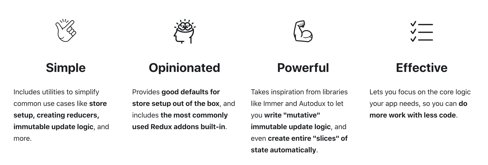

# Redux TooiKit

Redux Toolkit은 Redux를 더 사용하기 쉽게 만들기 위해 Redux에서 공식 제공하는 개발도구이다. Redux Toolkit은 아래와 같은 Redux의 문제점을 보완하기 위해 등장하였다. 기본적으로 비동기작업을 위한 thunk, saga 관련 기능이 내장되어 있고 액션을 간편하게 명시하기 위한 redux-actions 관련 기능 또한 내장되어 있다.

- 저장소 구성의 복잡성
- 많은 패키지 필요성(의존성)
- 한 작업 시 필요한 수 많은 코드양(boilerplate)

Redux TooiKit의 특징은 다음과 같다.



## 사용방법

기본적인 형태는 아래와 같다.

```jsx
import { createAction, createReducer } from "@reduxjs/toolkit";

// ducks 패턴이니 액션이름은 '리듀서이름/액션이름' 형태로 작성해주면 좋다.
// createAction()를 통해 간편하게 액션을 정의할 수 있다.
export const 액션이름 = createAction("액션이름");

// switch 문을 사용했던 reducer 부분을 createReducer()를 통해 정의할 수 있다.
const 리듀서이름 = createReducer(초기상태 값, {
    [액션이름]: (state, action) => {해당 액션이 dispatch 되었을때 실행될 동작},
})

export default 리듀서이름
```

> [상세코드](https://github.com/boyon99/react-project/commit/91b6880ba9ebcc7271e135607a4cbef70617e98e)에서 확인할 수 있다.

- createSlice 라는 함수 사용하기

reducers 안에서 액션 이름을 작성하면, 자동으로 해당 액션 타입/객체가 만들어진다.

```js
export const 슬라이스 이름 = createSlice({
  name: '리듀서 이름',
  초기상태 값,
  reducers: {
    액션이름: (state, action) => {
      액션 dispatch 시 실행될 코드
    },
  },
});
```

아래와 같이 `.actions` 혹은 `.reducers` 를 통해서 `액션 / 리듀서`를 꺼내올 수 있다.

```jsx
슬라이스 이름.actions
슬라이스 이름.reducers
```

> [상세코드](https://github.com/boyon99/react-project/commit/25dcc7470e13cabeff26f62c744d219784fe0777)에서 확인할 수 있다.

### 파일 생성 및 세팅하기

- store.js 파일을 생성한다.

```js
// store.js
import { configureStore } from "@reduxjs/toolkit";

export default configureStore({
  reducer: {},
});
```

- index.js 파일에 리덕스 세팅을 위한 `Provider`를 작성한다.

```js
// index.js
import { Provider } from "react-redux";
import store from "./store.js";

const root = ReactDOM.createRoot(document.getElementById("root"));
root.render(
  <React.StrictMode>
    <Provider store={store}>
      <BrowserRouter>
        <App />
      </BrowserRouter>
    </Provider>
  </React.StrictMode>
);
```

<br/>

### 데이터 저장 및 불러오기

- store.js에 `createSlice()`를 이용하여 state를 보관한다.

```js
// store.js
import { configureStore, createSlice } from "@reduxjs/toolkit";

// useState와 유사한 역할이다.
let storeState = createSlice({
  name: "name", // 이름
  initialState: "value", // 값
});

let stock = createSlice({
  name: "stock", // 이름
  initialState: [10, 11, 12], // 값
});

export default configureStore({
  reducer: {
    // 등록하기
    name: name.reducer,
    stock: stock.reducer,
  },
});
```

- `useSelector()`를 통해 데이터를 받는다.

```js
// cart.js
import { useSelector } from 'react-redux';

const Cart = () => {
  let a = useSelector((state) => { return state })
  console.log(a.storeState, a.stock)
  return (
  );
};
```

<br/>

### 데이터 변경 함수 생성 및 사용하기

- `reducers`안에 state 변경함수인 `action`을 만들고 `actions`를 통해 내보낸다.

```js
// store.js
let title = createSlice({
  name: "Cart",
  initialState: "first",
  reducers: {
    // state 변경함수 - action 이라고 한다.
    setName(state) {
      let copy = state;
      return copy === "frist" ? "second" : "frist";
    },
  },
});

// 내보내기
export let { setName } = title.actions;
```

- `useDispatch()`를 통해 변경함수를 사용한다.

```js
// cart.js
import { setName } from "../store";

const Cart = () => {
  // store state 받아오기
  let title = useSelector((state) => {
    return state.title;
  });
  // useDispatch()를 통해 변경함수 사용하기
  let dispatch = useDispatch();

  return (
    <>
      <h1>{title}</h1>
      <button
        onClick={() => {
          // 변경함수 사용하기
          dispatch(setName());
        }}
      >
        name
      </button>
    </>
  );
};
```

<br/>

### state가 복잡한 구조로 되어 있는 경우 state를 변경하는 방법

리덕스 설치 시 자동으로 immer 라이브러리가 설치되며 적용된다. 이에 따라 별도로 깊은 복사를 해줄 필요가 없다.

<br/>

### 매개변수 사용하기

- `payload`를 통해 매개변수를 사용한다.

```js
// cart.js
<button
  onClick={() => {
    dispatch(setStock(stock[i].id));
  }}
>
  +1
</button>
```

```js
// stock.js
let stock = createSlice({
  name: "stock", // 이름
  initialState: [
    { id: 0, name: "White and Black", count: 2 },
    { id: 2, name: "Grey Yordan", count: 1 },
  ], // 값
  reducers: {
    // state 변경함수 - action 이라고 한다.
    setStock(state, action) {
      let count = state.findIndex((a) => {
        return a.id === action.payload;
      });
      // return 문을 사용할 경우 오류가 생긴다. 괄호가 없는 화살표 함수를 이미 return 문으로 작동하기 때문이다.
      state[count].count++;
    },
  },
});
```

<br/>

## thunk를 이용하여 비동기 작업을 처리하는 방법

`AsyncThunk`는 비동기 작업을 처리를 하는 액션을 만들어준다.

```js
<button
  onClick={() => {
    dispatch(asyncUpFetch());
  }}
>
  +
</button>;

const asyncUpFetch = createAsyncThunk("counterSlice/asyncUpFetch", async () => {
  const resp = await fetch("");
  const data = await resp.json();
  return data.value;
});
```
